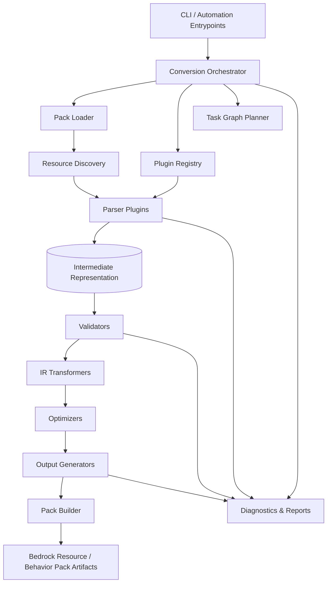
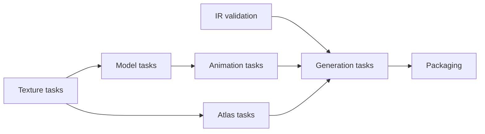

# JavaCVBedrock Architecture

JavaCVBedrock is being refactored from feature-specific scripts into a modular conversion platform. The converter is organized around a strict rule: every module communicates through an Intermediate Representation (IR), never through source-pack-specific or Bedrock-specific structures.

## Architecture



## Data Flow


## Pipeline Stages

Each class owns exactly one stage. A parser parses. A validator validates. A generator generates. Cross-stage orchestration belongs only to the orchestrator and task graph planner.

| Stage | Responsibility | Produces |
| --- | --- | --- |
| Discovery | Locate candidate files and infer resource families. | Discovery records |
| Loading | Read bytes and metadata from a pack source. | Loaded resources |
| Parsing | Convert source-specific files to IR. | IR resources |
| Validation | Report invalid, risky, or unsupported IR. | Diagnostics |
| Transformation | Convert IR into more Bedrock-ready IR without reading source plugin formats. | IR resources |
| Optimization | Deduplicate, compress, atlas, or normalize IR. | Optimized IR |
| Generation | Emit Bedrock files from IR. | Generated files |
| Packaging | Assemble generated files into distributable packs. | Output artifacts |

## Intermediate Representation

The IR is the stable contract between all modules. Parser plugins such as Vanilla, ItemsAdder, Nexo, Oraxen, ExecutableItems, and MMOItems produce IR. Converters, validators, optimizers, and generators consume IR only.

```mermaid
classDiagram
    class ResourceId
    class Resource
    class TextureResource
    class ModelResource
    class FontResource
    class SoundResource
    class AnimationResource
    class ItemResource
    class BlockResource
    class EntityResource
    class AttachableResource
    class ParticleResource
    class LanguageResource
    class AtlasResource
    class PackMetadataResource
    class ManifestResource
    Resource <|-- TextureResource
    Resource <|-- ModelResource
    Resource <|-- FontResource
    Resource <|-- SoundResource
    Resource <|-- AnimationResource
    Resource <|-- ItemResource
    Resource <|-- BlockResource
    Resource <|-- EntityResource
    Resource <|-- AttachableResource
    Resource <|-- ParticleResource
    Resource <|-- LanguageResource
    Resource <|-- AtlasResource
    Resource <|-- PackMetadataResource
    Resource <|-- ManifestResource
    Resource --> ResourceId
```



## Module Dependencies

```mermaid
flowchart TD
    plugins --> pipeline
    plugins --> ir
    pipeline --> ir
    pipeline --> diagnostics
    graph --> pipeline
    graph --> diagnostics
    generation --> ir
    generation --> diagnostics
    generation --> pipeline
    cli --> plugins
    cli --> graph
    cli --> pipeline
```

Forbidden dependencies:

- Generators must not depend on ItemsAdder, Nexo, Oraxen, ExecutableItems, MMOItems, or Vanilla parser internals.
- Converters/transformers must not write Bedrock files directly.
- Parsers must not call generators.
- Validators must not mutate resources.

## Task Graph

Conversion is planned as a dependency graph so future implementations can run independent work in parallel.



Nodes declare inputs, outputs, and dependencies. The executor is responsible for topological ordering, failure propagation, cancellation, and future parallel scheduling.

## Folder Structure

```text
javacvbedrock/
  diagnostics/   Diagnostic severity, conversion logs, unsupported feature reports.
  graph/         Task graph contracts and execution planning primitives.
  generation/    Generator interfaces and generated-file contracts.
  ir/            Source- and target-neutral Minecraft resource object model.
  pipeline/      Stage interfaces for discovery, loading, parsing, validation, transformation, optimization, generation, packaging.
  plugins/       Parser plugin contracts and registry.
docs/architecture/
  README.md      Architecture diagrams and design rules.
```

## Design Rules

1. The IR is the only integration boundary between stages.
2. Parser plugins may understand source formats; no other module may depend on source plugin formats.
3. Output generators may understand Bedrock output formats; no parser or transformer may call them directly.
4. Diagnostics are structured as warnings, recoverable errors, fatal errors, and unsupported feature reports.
5. Graph nodes are small, typed units of work designed for future parallel execution.
6. New resource families should add IR types and stage implementations without changing existing parser or generator contracts.
